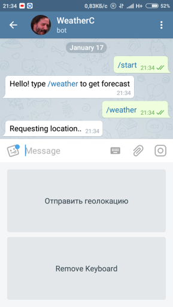

# BRUS1NATOR-TelegramWeatherBot

BE AWARE! THIS IS AN OLD PROJECT BASED ON v13.2.1 BOT API AND PORTED TO v15.7.1, SOMETHING MAY NOT WORK AS EXPECTED.

Телеграм Бот который показывает текущую погоду и прогноз, основываясь на текущей геолокации или названии города. Для получения данных о погоде используется OpenWeather API.

Telegram Bot that shows current weather and forecast, based on your current location or city name. OpenWeather API is used to get weather data. Code comments project are in russian.

